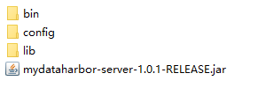
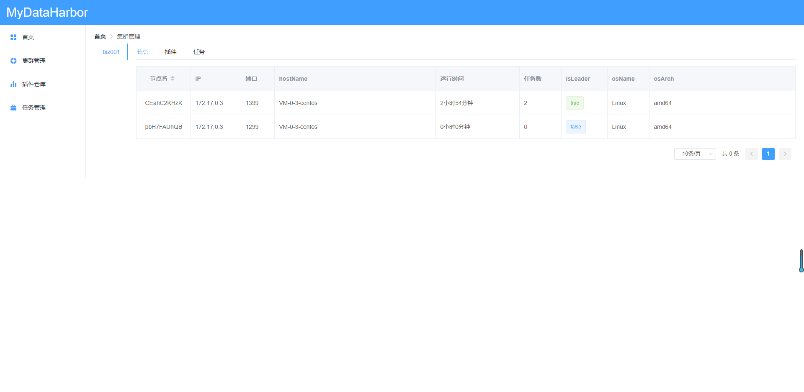

<GitHubWrapper>
<p align="center">
	<br/>
  <a href="http://www.mydataharbor.com" target="_blank">
    
  </a>
</p>

<TitleInfos />

<p align="center" class="print-break">
    <a href="https://mydataharbor.com" style="display:inline-block"><words type='updated' /></a>
    <a href="https://github.com/mydataharbor/mydataharbor/actions/workflows/maven.yml" target="_blank" style="display:inline-block" class="not-print">
       
    </a>
     <a href="https://github.com/mydataharbor/mydataharbor/releases" target="_blank" style="display:inline-block" class="not-print">
       
    </a>
    <a href="https://search.maven.org/search?q=com.mydataharbor" target="_blank" style="display:inline-block" class="not-print">
       
    </a>
    <a href="https://github.com/mydataharbor/mydataharbor/releases" target="_blank" style="display:inline-block" class="not-print">
       
    </a>
    <a href="https://github.com/mydataharbor/mydataharbor/blob/main/LICENSE" target="_blank" style="display:inline-block" class="not-print">
       
    </a>
    <a href="https://mydataharbor.yuque.com/books/share/d5b1360e-d316-4be0-85de-b0958ac64267/pckin3" target="_blank" style="display:inline-block">
      
    </a>
   
</p>
</GitHubWrapper>

欢迎前端、插件开发人员前来贡献代码，感兴趣的请联系我：1053618636@qq.com

## 简介/定位

:cn: 🚢 MyDataHarbor是一个致力于解决任意数据源到任意数据源的分布式、高扩展性、高性能、事务级的数据同步中间件。

它可以帮助用户可靠、快速、稳定的对海量数据进行准实时增量同步或者定时全量同步，主要定位是为实时交易系统服务，亦可用于大数据的数据同步（ETL领域）。

## 背景

在微服务的大背景下，实时交易系统的数据的分散存储已经成为常态，然而有时候我们需要对这些数据进行实时或者定时全量的进行同步到另外一个地方。

比如，一个公司的C部门的系统，需要用到A、B部门产生的数据，这时候避免不了进行全量或者增量的数据同步。再比如，数据库中的数据我要实时同步到elasticsearch、redis等等中进行搜索。

数据同步的应用场景在日常的分布式系统开发中非常常见，而且非常重要，一旦数据同步出现问题，将会导致数据不一致，引起其他异常。

目前小公司的做法是在业务程序系统里修改代码，往目标数据源中写入数据，上点规模的公司的做法是，各个部门开发一套自己的同步小程序，没有管理，更可能没有监控，来一个需求开发一个、非常浪费资源，稳定性也得不到保障，而大公司则是有一套数据迁移平台（如阿里的精卫）。

MyDataHarbor在这种场景需求下应用而生！

## 特性

 ### 🚩分布式设计

   MyDataHarbor是一个在zookeeper上构建的分布式中间件，支持水平扩展，对节点进行分组，各分组下的机器形成一个子集群，任务在子集群隔离范围内进行负载均衡，防止单点故障。

 ### 🚩插件式设计

   高度合理的抽象、插件化的设计使得MyDataHarbor拥有很高扩展性，任何数据迁移的需求都可以通过开发插件完成。

 ### 🚩事务支持

   MyDataHarbor设计之初就考虑到数据丢失问题，引入事务的支持保障数据不丢失！

 ### 🚩插件自描述

   安装插件后中间件会自动识别这个插件的能力，并且生成用户UI友好的任务创建界面，不需要用户直接编写复杂的json配置。

 ### 🚩自由组合

   MyDataHarbor支持从不同的插件中复用各种组件，形一个新的pipline管道，并且这些都是可以通过可视化的方式进行。

 ### 🚩任务监控

   对接java的jmx，每个任务都有详细的监控，实时查看任务的运行状态。

 ### 🚩批量支持

   为可以批量进行提交的写入源预留批量接口通道，有效提升数据迁移速度，摩托变汽车。

 ### 🚩ForkJoin

   对于DataSource无法多线程并发拉取的情况下（如jdbc游标取数据），内部引入forkjoin并发处理模型开启多线程处理，并且灵活的事务控制，让速度飞快的同时保证数据迁移的稳定、不丢失，汽车变高铁。

## 宏观设计

MyDataHarbor唯一依赖的中间件是zookeeper，共有两个组件：mydataharbor-console、mydataharbor-server，只依赖了zk集群，无其他依赖，可以水平扩展部署

- mydataharbor-console

  该应用是一个springboot应用，内部实现了对整个集群的管理，插件仓库服务/管理，可视化任务管理。

- mydataharbor-server

  该应用是数据搬移任务工作的具体环境，提交的任务都会分配到该节点上，该应用是一个可以大规模部署的纯java应用，依赖zookeeper做分布式协调。

## 支持的插件

| 中间件/协议        | 数据源（DataSource） | 写入源（Sink）   |作者	|备注	 |
| ------------- | -------------------- | ---------------- |-----------|----------|
| kafka         | ✅全部版本        | ✅全部版本           |MyDataHarbor(1053618636@qq.com)||
| redis         | 暂不考虑          | ✅全部版本            |MyDataHarbor(1053618636@qq.com)||
| elasticsearch | 计划中            |✅5.6.x✅6.4.x✅6.0.x<br>✅6.8.x✅6.5.x✅6.6.x<br>✅6.7.x✅7.7.x✅7.13.x |MyDataHarbor(1053618636@qq.com)||
| http          | 暂不考虑          | ✅                |MyDataHarbor(1053618636@qq.com)||
| jdbc          | ✅mysql全部版本<br>✅oracle全部版本<br>✅hive全部版本<br>PostgreSQL计划中   | ✅mysql全部版本<br>✅oracle全部版本<br>PostgreSQL计划中           |MyDataHarbor(1053618636@qq.com)|三种模式(全量/增量/先全量再增量)<br>❗ 此种方式无法同步删除的数据|
| MongoDB       | 计划中          | 计划中                |虚位以待	|	|
| binlog       | 计划中          | ×                |虚位以待			|		|


## 快速开始

MyDataHarbor的安装非常简单（启动前请先准备好zookeeper集群）：

### 下载二进制包

下载地址：[https://github.com/mydataharbor/mydataharbor/releases](https://github.com/mydataharbor/mydataharbor/releases)
下载列表：

      mydataharbor-console-xxx-bin.tar.gz
      mydataharbor-server-xxx-bin.tar.gz
      
> xxx是发行的版本号

### mydataharbor-console 

#### 解压

 

#### 配置

进入config目录，修改application.yml，主要修改如下配置 

```yaml
server:
  port: 8080 #console服务启动端口
zk: 127.0.0.1:2181 #zk地址
```

#### 运行

Windows系统下运行 start.bat<br>
Linux系统下运行 start.sh  关闭stop.sh 

> start.sh 脚本支持 jmx、debug、status参数 如：<br>
>  start.sh jmx   启动远程jmx支持 <br>
> start.sh debug 开启远程debug方式启动 <br>
> start.sh status 查看当前程序状态 

### mydataharbor-server 

#### 解压



#### 配置

修改config目录下的system.yml 
```yaml
zk: ["127.0.0.1:2181"] #zk地址
port: 1299 #server服务启动端口
group: biz001 #该节点所属组
pluginRepository: http://127.0.0.1:8080 #插件仓库地址
```
#### 运行
Windows系统下运行 start.bat<br>
Linux系统下运行 start.sh  关闭stop.sh 

> start.sh 脚本支持 jmx、debug、status参数 如：<br>
>  start.sh jmx   启动远程jmx支持 <br>
> start.sh debug 开启远程debug方式启动 <br>
> start.sh status 查看当前程序状态 

#### 验证
访问：mydataharbor-console  [http://127.0.0.1:8080](http://127.0.0.1:8080)
是否可以看到刚刚启动的节点 
 

## 其它
demo运行实例：http://118.25.5.236:8083/

文档(语雀)：http://doc.mydataharbor.com

#### QQ群（**<u>*加群时需要验证项目star数，请star一下然后记下star数告诉管理员*</u>**）


